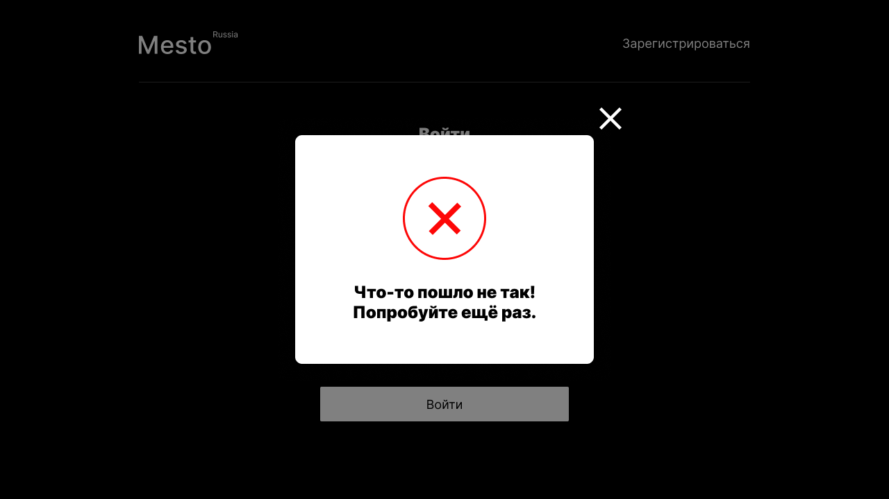

# PLACE 

### *Educational purpose project from [Яндекс.Практикум](https://practicum.yandex.ru/web/)*

<hr>

### A simple interactive single-page service written on React.js

## Functionality

- Edit user's avatar and profile information;
- Add photos and likes;
- Remove photos and likes;
- Open full-screen photos;
- User authorization and registration.

<hr>

## Screenshots

<details><summary><b>Show all</b></summary>





</details>

<hr>

## Technologies Used

- HTML5;
- CSS3:
    - Flexbox;
    - Grid Layout;
    - Positioning;
    - Adaptive UI;
    - Media Queries;
- BEM methodology (nested/flat);
- JavaScript:
    - CamelCase style;
    - Object-oriented programming;
    - Promise, asynchronous functions;
    - API (Application Programming Interface);
- Webpack:
    - Project files are bundled using [Webpack](https://webpack.js.org/) technology, which takes the dependencies and generates a dependency graph allowing web developers to use a modular approach for their web application development purposes.
- React JS:
    - Create React App;
    - JSX;
    - Functional components;
    - Hooks.

## Usage

Clone repository:

    git clone https://github.com/letStayFoolish/react-mesto-auth

Install dependencies:

    npm install

Run app:

    npm run start

## Language:

- JavaScript

## Libraries & Frameworks:

- ReactJS

## Figma designs:

- [Figma 4](https://www.figma.com/file/2cn9N9jSkmxD84oJik7xL7/JavaScript.-Sprint-4);
- [Figma 5](https://www.figma.com/file/bjyvbKKJN2naO0ucURl2Z0/JavaScript.-Sprint-5);
- [Figma 6-7](https://www.figma.com/file/kRVLKwYG3d1HGLvh7JFWRT/JavaScript.-Sprint-6);
- [Figma 9](https://www.figma.com/file/PSdQFRHoxXJFs2FH8IXViF/JavaScript-9-sprint);
- [Figma 12](https://www.figma.com/file/5H3gsn5lIGPwzBPby9jAOo/JavaScript.-Sprint-12).

## Project's checklists:

- [Checklist 4](https://code.s3.yandex.net/web-developer/checklists/new-program/checklist-4/index.html);
- [Checklist 5](https://code.s3.yandex.net/web-developer/checklists/new-program/checklist-5/index.html);
- [Checklist 6](https://code.s3.yandex.net/web-developer/checklists/new-program/checklist-6/index.html);
- [Checklist 7](https://code.s3.yandex.net/web-developer/checklists/new-program/checklist-7/index.html);
- [Checklist 8](https://code.s3.yandex.net/web-developer/checklists/new-program/checklist-8/index.html);
- [Checklist 9](https://code.s3.yandex.net/web-developer/checklists/new-program/checklist-9/index.html);
- [Checklist 10](https://code.s3.yandex.net/web-developer/checklists/new-program/checklist-10/index.html);
- [Checklist 11](https://code.s3.yandex.net/web-developer/checklists/new-program/checklist-11/index.html);
- [Checklist 12](https://code.s3.yandex.net/web-developer/checklists/new-program/checklist-12/index.html).

## Deploy
Check out this website on :
- [Vercel](https://react-mesto-auth-delta-one.vercel.app/sign-in)

## License

````
This project is licensed under the Yandex Practicum License.
````
<hr>

Copyright (c) _2023_ _Nemanja Karaklajic_
